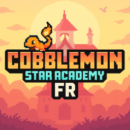

<h1 align="center">Cobblemon Star Academy FR</h1>

[
]()

---

### **<ins>
Fonctionnalitées du launcher :
**

- ✅ Jouer directement avec le modpack entier à jour

- 🔒 Authentification Microsoft.

- ⛏️ Pour le moment version 1.20.1 de Minecraft

- 📦 Version 1.5.2 du ModPack Star Academy

- 📰 Suiver les actualités depuis le launcher

- 🟢 Statut du serveur Cobblemon Star Academy FR complet.

    - Opérationnel ou hors ligne.
    
    - Nombres de joueurs connectés.

---

### **<ins>
Téléchargement :
**

Vous pouvez télécharger le launcher à partir des [Releases GitHub](../../../releases).

Plateformes supportées :

- Windows 
- Linux
- MacOS

Si vous téléchargez à partir des Releases, sélectionnez le programme d'installation de votre système.

 Plateforme | Fichier |
| -------- | ---- |
| Windows x64 | `Cobblemon-Star-Academy-FR-Launcher-win-x64.exe ` |
| macOS x64 | `Cobblemon-Star-Academy-FR-Launcher-mac-x64.dmg` |
| macOS arm64 | `Cobblemon-Star-Academy-FR-Launcher-mac-arm64.dmg` |
| Linux x64 | `Cobblemon-Star-Academy-FR-Launcher-linux-x86_64.AppImage` |

---